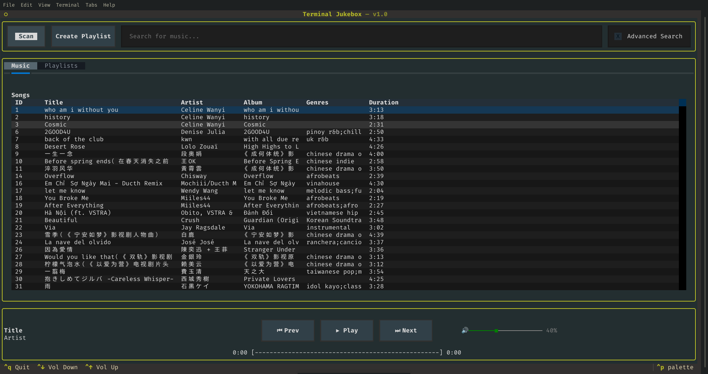
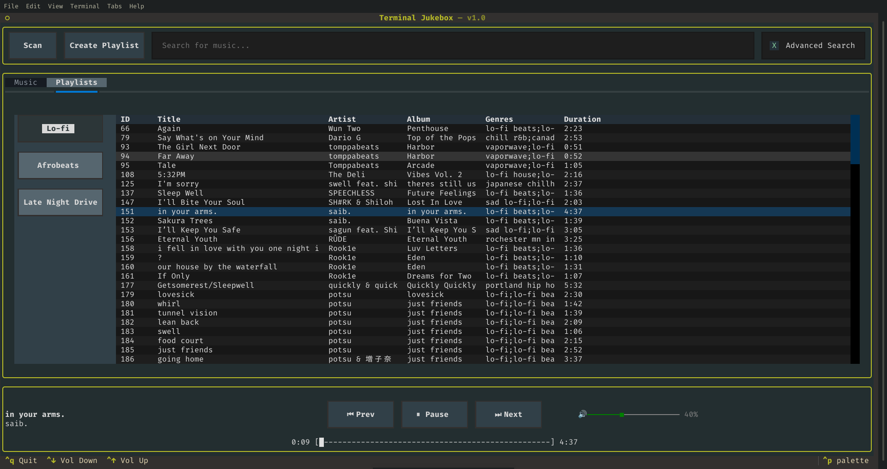
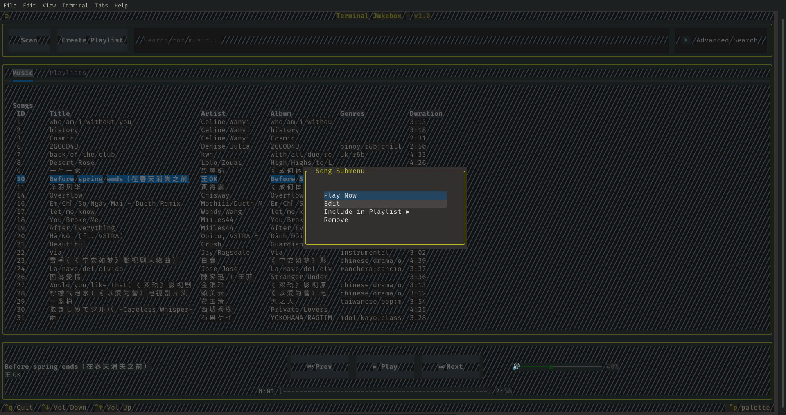
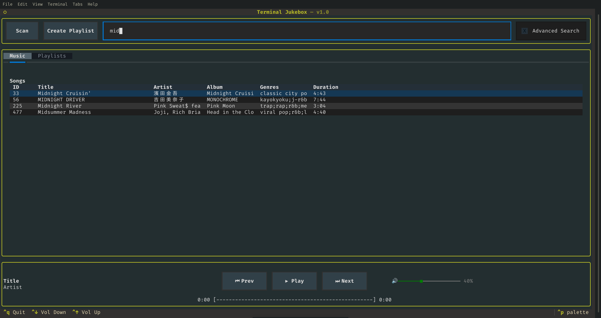
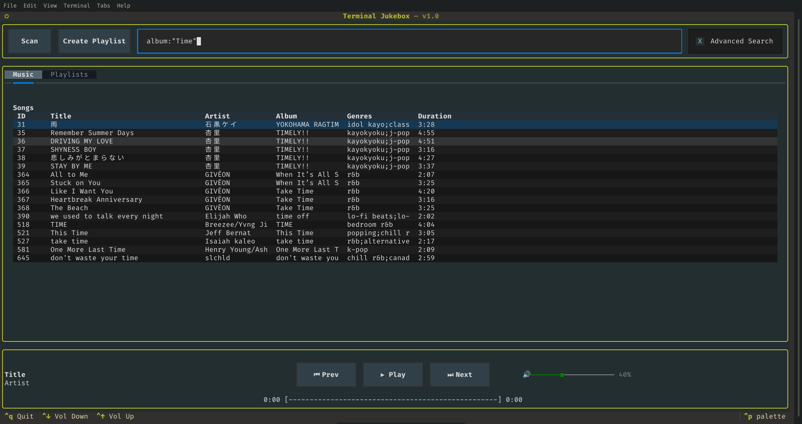
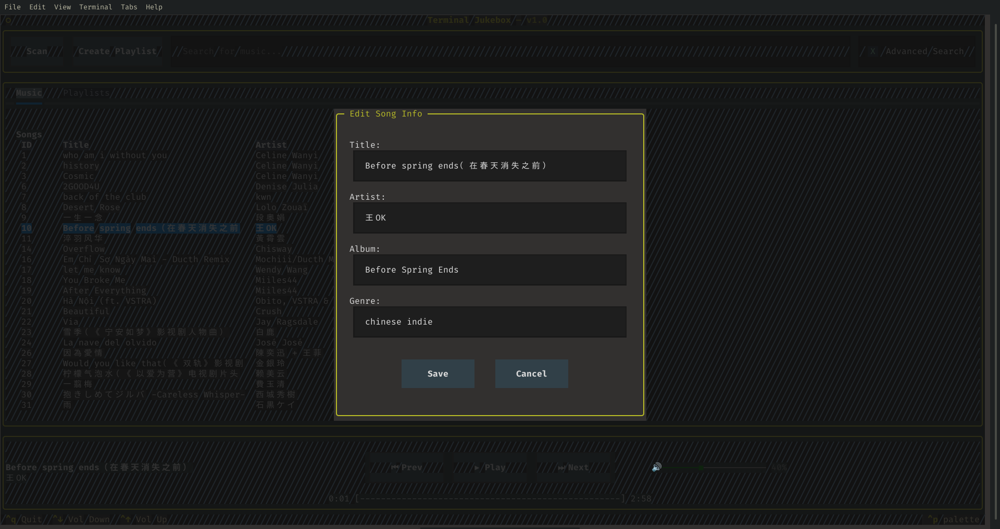
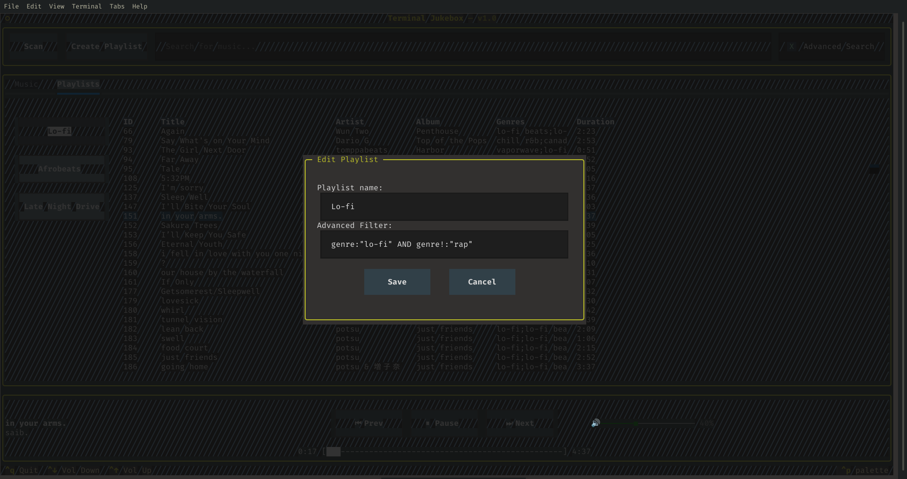
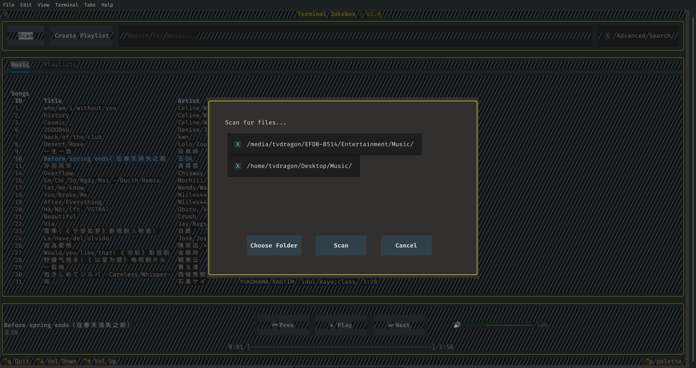

<h1 align="center">Terminal Jukebox</h1>

Terminal Jukebox is a terminal-based music player built with Python and the Textual framework.

It allows you to manage and play your local music collection directly from the terminal, with support for scanning music folders, organising songs into playlists, searching your library, and controlling playback.

## Motivation

I created Terminal Jukebox as a way to build a fully featured music player that runs directly in the terminal.

The project also gave me an opportunity to experiment with Python, Textual, SQLite, asynchronous/background tasks, audio playback, and building a larger application with a modular structure.

Instead of relying on a graphical desktop music player, Terminal Jukebox provides a keyboard and terminal focused interface for managing and listening to a local music library and you can use your mouse to peform these operations.

## Features

- Scan folders for music files to add to your music library
- Detect songs using acoustic fingerprints
- Store music metadata in an SQLite database
- Basic and advanced music search
- Advanced filtering using `AND`, `OR`, grouping, and exclusions
- Create and manage playlists
- Create Auto Playlists using search filters
- Add and remove songs from playlists
- Rename and delete playlists
- Play songs directly from the library
- Play songs from playlists
- Previous, play/pause, and next controls
- Song progress indicator
- Volume control
- Edit song metadata
- Remove songs from the library
- Terminal-based user interface

## Getting Started

### Prerequisites

- Python 3.13 or later
- pip
- GNU Make (for the Makefile installation method)
- A terminal capable of displaying the Textual interface
- A local music collection

### Installing

Clone the repository:

    git clone https://github.com/TvDragon/terminal-jukebox.git

Move into the project directory:

    cd terminal-jukebox

### Option 1: Using Makefile

The recommended installation method is to use the provided [Makefile](./Makefile).

Create the virtual environment to install the required dependencies and build the application:

    make install
    make build

The Makefile will:

1. Create a Python virtual environment in env/.
2. Install the required packages from requirements.txt.
3. Build the application as a standalone exectuable found inside dist/.

#### Makefile Commands

The following commands are available:

| Command | Description |
|---|---|
| `make install` | Creates the virtual environment and installs dependencies |
| `make test` | Runs the test suite |
| `make build` | Builds the application using PyInstaller |
| `make clean` | Removes the virtual environment and build files |

### Option 2: Manual Installation and Setup

If you do not have `make` installed, you can set up the project manually.

Create a virtual environment:

    python3 -m venv env

Activate the virtual environment.

#### Linux/macOS

    source env/bin/activate

#### Windows

    env\Scripts\activate

Install the required Python packages:

    pip install -r requirements.txt

## Usage

Once the dependencies have been installed, start Terminal Jukebox with:

    python3 src/main.py

or:

    python src/main.py

The application will open in your terminal.

Maximize the application to view and use the application properly.

## Controls

The exact keyboard controls may change as development continues.

| Action | Key |
|---|---|
| Switch to next widget action | `Tab` |
| Switch to previous widget action | `Shift + Tab` |
| Quit | `Ctrl + Q` |
| Increase Volume | `Ctrl + Up Arrow` |
| Decrease Volume | `Ctrl + Down Arrow` |

### Context Menus

Right-click songs and playlists to open their context menus and access additional actions such as editing, adding songs to playlists, renaming, and deleting.

## Music Library

Terminal Jukebox allows you to add folders containing your music collection.

When a folder is scanned, Terminal Jukebox searches for supported music files (.mp3 and .flac) and adds them to the library.

Songs are stored in an SQLite database along with their metadata and fingerprint information.

Acoustic fingerprints are used to identify songs rather than relying solely on file metadata. This allows the application to recognise the same song even if its metadata has been changed.

## Playlists

You can create playlists to organise songs in your music library.

Playlists support:

- Creating playlists and Auto Playlist with filters
- Adding songs to playlists
- Removing songs from playlists
- Renaming and editing playlists
- Deleting playlists
- Playing songs from a playlist

## Searching

The music library can be searched using the search field.

Search results can be used to quickly find songs in the library and play them or add them to playlists.

### Advanced Search & Filtering

Terminal Jukebox supports an advanced search syntax that allows songs to be filtered using conditions, logical operators, and exclusions.

This filtering system is also used by Auto Playlists, allowing playlists to automatically include songs that match a set of conditions.

#### Examples

Search for songs with either `lo-fi` or `chill` in their genres:

    (genre:"lo-fi" OR genre:"chill")

Exclude songs that have `rap` as a genre:

    genre!:"rap"

Conditions can also be combined:

    (genre:"lo-fi" OR genre:"chill") AND genre!:"rap"

The above query finds songs where the genre contains either `lo-fi` or `chill`, while excluding songs that also contain `rap`.

#### Supported Operators

| Operator | Description |
|---|---|
| `:` | Contains a field |
| `!:` | Does not contain a field |
| `=` | Exactly matches a field |
| `!=` | Excludes an exactly matched field |
| `AND` | Requires both conditions to match |
| `OR` | Requires either condition to match |
| `()` | Groups conditions together |

#### Field Examples

Filters can be applied to different song fields, for example:

    title!:"Around"

    artist="Daft Punk"

    album:"Discovery"

    genre:"rock"

Fields can also be combined:

    genre:"rock" AND artist:"Queen"

    genre:"jazz" OR genre:"blues"

    genre!:"rap" AND genre!:"metal"

#### Auto Playlists

The advanced filtering system can be used to create Auto Playlists.

Instead of manually adding songs to an Auto Playlist, a filter determines which songs belong to the playlist.

For example:

    (genre:"lo-fi" OR genre:"chill") AND genre!:"rap"

An Auto Playlist using this filter will automatically contain songs whose genres include either `lo-fi` or `chill`, while excluding songs that contain `rap`.

This means that when songs are added to the library or their metadata changes, the contents of the Auto Playlist can be updated based on the filter.

## Project Structure

The project is organised into separate components based on their responsibilities.

    terminal-jukebox/
    ├── src/
    │   ├── database/
    │   ├── models/
    │   ├── screens/
    │   ├── services/
    │   ├── utils/
    │   ├── widgets/
    │   |   ├── buttons/
    │   |   └── tables/
    │   └── main.py
    │
    ├── requirements.txt
    └── README.md

### Database

Contains the SQLite database connection and database-related operations.

### Models

Contains objects representing entities used by the application, such as songs and playlists.

### Screens

Contains the different Textual screens and modal screens used by the application.

### Services

Contains application logic such as music library management, scanning folders, playlists, and music playback.

### Utils

Contains utility functions used by different parts of the application, such as hashing, logging, and other helper functions.

### Widgets

Contains reusable Textual widgets used throughout the application.

#### Buttons

Contains Textual `Button` implementation used to display playlist buttons.

#### Tables

Contains Textual `DataTable` implementation used to display music information.

## Screenshots

### Music Library

### Playlist

### Song Options

### Basic Search

### Advanced Search

### Edit Song

### Edit Playlist

### Scan Music

## Technologies

Terminal Jukebox is built using:

* [![Python][Python]][python-url]
* [![SQLite][SQLite]][sqlite-url]
* [![Textual][Textual]][textual-url]
* [just_playback][just-playback-library]
* [pyacousticid][pyacousticid-library]

## AI Assistance

Parts of this project were developed with assistance from AI tools.

AI assistance was used for areas such as:
- Code suggestions and implementation ideas
- Debugging and troubleshooting
- Project structure
- Documentation and README writing

All AI-generated suggestions were reviewed, modified, and integrated into the project by me.

For more specific information on where AI assistance was used can be read [here](./AI_ACKNOWLEDGEMENTS.md).

## License

This project is licensed under the MIT License.

See the [`LICENSE`](./LICENSE) file for more information.

[Python]: https://img.shields.io/badge/Python-ECD53F?style=for-the-badge&logo=python&logoColor=3776AB
[python-url]: https://www.python.org/downloads/
[SQLite]: https://img.shields.io/badge/SQLite-FFFFFF?style=for-the-badge&logo=sqlite&logoColor=003B57
[sqlite-url]: https://www.sqlite.org/index.html
[Textual]: https://img.shields.io/badge/Textual-000000?style=for-the-badge&logo=textual&logoColor=FFFFF
[textual-url]: https://textual.textualize.io/
[just-playback-library]: https://github.com/cheofusi/just_playback
[pyacousticid-library]: https://github.com/beetbox/pyacoustid